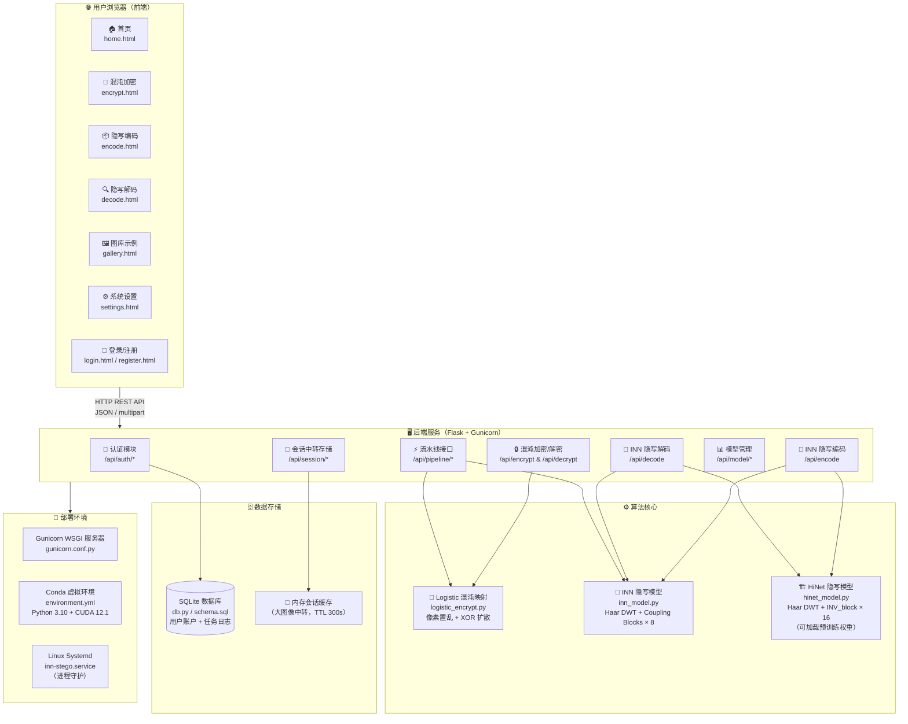

# INN 图像隐写系统 — 整体框架与技术介绍

> 本文档用于毕业设计答辩，系统介绍 INN 图像隐写系统的整体架构、核心算法及前后端技术选型。

---

## 一、系统整体框架图



---

## 二、核心业务流程

### 2.1 完整加密隐写流程

```
原始秘密图像
     │
     ▼  [Step 1] Logistic 混沌加密
     │   r=3.9991, x₀=0.37291, rounds=2
     │   ① 像素置乱（chaotic 排列索引）
     │   ② 像素扩散（逐像素 XOR 混沌流）
     ▼
加密噪声图像（外观随机）
     │
     ▼  [Step 2] INN / HiNet 隐写编码
     │   Cover 载体图像 + 加密秘密图像 → Stego 隐写图像 + 噪声张量 z
     │
     ▼
隐写图像（肉眼与载体不可区分） + 解码密钥 (stego_key)
```

### 2.2 完整解码解密流程

```
隐写图像 + stego_key（可选）
     │
     ▼  [Step 3] INN / HiNet 隐写解码
     │   精确模式：Stego + z → 加密秘密图像（无损）
     │   近似模式：Stego 单独 → 加密秘密图像（近似）
     ▼
加密噪声图像
     │
     ▼  [Step 4] Logistic 混沌解密
     │   逆向 XOR 扩散 → 逆向像素复位
     ▼
还原秘密图像
```

---

## 三、前端技术介绍

### 3.1 技术选型概览

| 类别 | 技术 | 说明 |
|------|------|------|
| 页面结构 | 纯 HTML5 | 无框架、零构建步骤，直接由 Flask 静态托管 |
| 样式系统 | Tailwind CSS v3（CDN） | 原子化 CSS，快速构建响应式 UI |
| 图标库 | Font Awesome 6（CDN） | 丰富矢量图标，无需额外资源 |
| 交互逻辑 | 原生 JavaScript（ES2020+） | `async/await`、`FormData`、`BroadcastChannel`、`localStorage` |
| 图表可视化 | Canvas API（内嵌） | 安全评分仪表盘等可视化元素 |
| 跨页通信 | `BroadcastChannel` API | 编码页↔解码页实时统计同步 |
| 持久化统计 | `localStorage` | 会话内 / 累计使用次数本地存储 |
| 图像预览 | `FileReader` API | 上传图像即时预览，无需服务器往返 |
| 会话传输 | Session Token + `sessionStorage` | 大图像（>5 MB）经服务器中转存储 |

### 3.2 前端页面结构

```
┌─────────────────────────────────────────────────────────┐
│  公共导航栏（固定顶部）                                    │
│  首页 | 混沌加密 | 隐写编码 | 隐写解码 | 图库示例 | 设置   │
├──────────────┬──────────────────────────────────────────┤
│ home.html    │  系统介绍、功能导航、快速入口               │
├──────────────┤                                          │
│ encrypt.html │  混沌加密                                 │
│              │  ① 上传秘密图像                           │
│              │  ② 可视化 Logistic 参数配置               │
│              │  ③ 执行加密，查看信息熵/NPCR/UACI 指标     │
│              │  ④ 传入隐写编码模块                        │
├──────────────┤                                          │
│ encode.html  │  INN 隐写编码                             │
│              │  ① 上传载体图像，自动载入加密秘密图像        │
│              │  ② 参数配置（隐藏强度）                    │
│              │  ③ 编码，查看 PSNR/SSIM，下载隐写图像      │
│              │  ④ 动态使用统计（localStorage 持久化）      │
├──────────────┤                                          │
│ decode.html  │  隐写解码                                 │
│              │  ① 上传隐写图像 + 可选 stego_key           │
│              │  ② 精确/近似两种解码模式                   │
│              │  ③ 查看还原秘密图像，可进一步混沌解密        │
├──────────────┤                                          │
│ gallery.html │  图库示例                                 │
│              │  典型案例展示（载体/隐写/还原三列对比）       │
│              │  PSNR / SSIM / 图像大小 指标卡片           │
├──────────────┤                                          │
│ settings.html│  系统设置：主题切换、API 地址配置等         │
├──────────────┤                                          │
│ login /      │  用户认证（JSON API，Flask session）       │
│ register.html│                                          │
└──────────────┴──────────────────────────────────────────┘
```

### 3.3 关键前端交互设计

- **拖拽上传**：所有图像区域支持 `dragover` / `drop` 事件，配合 `FileReader` 即时预览。
- **进度动画**：加密/编码期间使用 CSS `@keyframes` 动画进度条模拟阶段进度，提升用户体验。
- **跨步骤数据传递**：加密页完成后，加密图像通过 `/api/session/store` 存入服务器内存缓存（TTL 300 s），编码页通过 token 取回，避免 `sessionStorage` 5 MB 限制。
- **动态统计**：编码次数、解码次数通过 `localStorage` 跨会话持久化；两个页面通过 `BroadcastChannel('inn_stego')` 实时同步解码计数。
- **灯箱预览**：点击任意结果图像触发全屏 Lightbox 弹窗（纯 CSS + JS，无第三方依赖）。

---

## 四、后端技术介绍

### 4.1 技术选型概览

| 类别 | 技术 | 版本 | 说明 |
|------|------|------|------|
| Web 框架 | Flask | ≥ 3.0 | 轻量级 Python Web 框架，REST API |
| 跨域支持 | Flask-CORS | ≥ 4.0 | 允许前端跨域调用（开发模式） |
| 生产服务器 | Gunicorn | ≥ 20.0 | WSGI 多进程服务器，Sync Worker |
| 深度学习框架 | PyTorch | 2.1.0+cu121 | INN / HiNet 模型推理 |
| 图像处理 | Pillow | ≥ 10.4 | 图像读写、格式转换、缩放 |
| 科学计算 | NumPy + SciPy | 1.26 + 1.13 | 混沌序列生成、信号处理 |
| 数据库 | SQLite3（内置） | — | 用户账户持久化，零外部依赖 |
| 进程守护 | systemd | — | Linux 服务管理，开机自启 |
| 运行环境 | Conda | — | Python 3.10 隔离环境管理 |
| CUDA | CUDA 12.1 | — | NVIDIA GPU 加速推理 |

### 4.2 后端目录结构

```
backend/
├── app.py              # Flask 主应用，所有 REST 路由
├── inn_model.py        # INN 隐写模型（Haar DWT + Coupling Blocks，无需预训练）
├── hinet_model.py      # HiNet 隐写模型（可加载 HiNetcp/train.py 输出权重）
├── logistic_encrypt.py # Logistic 混沌加密/解密算法
├── db.py               # SQLite 数据访问层
├── schema.sql          # 数据库表结构
├── gunicorn.conf.py    # Gunicorn 生产配置
└── requirements.txt    # pip 依赖清单

HiNetcp/                # HiNet 训练代码（独立子模块）
├── hinet.py            # HiNet 网络定义（16 × INV_block）
├── invblock.py         # 可逆块（Affine Coupling + DWT）
├── model.py            # 子网络（DenseBlock + ResidualBlock）
├── train.py            # 训练脚本
├── config.py           # 超参数配置
└── ...
```

### 4.3 REST API 接口一览

| 方法 | 路径 | 功能 |
|------|------|------|
| GET  | `/api/health` | 健康检查，返回模型状态 |
| POST | `/api/auth/login` | 用户登录 |
| POST | `/api/auth/logout` | 用户登出 |
| POST | `/api/auth/register` | 用户注册 |
| POST | `/api/encrypt` | Logistic 混沌加密 |
| POST | `/api/decrypt` | Logistic 混沌解密 |
| POST | `/api/encode` | INN/HiNet 隐写编码 |
| POST | `/api/decode` | INN/HiNet 隐写解码 |
| POST | `/api/pipeline/encrypt_encode` | 混沌加密 + 隐写编码（一键） |
| POST | `/api/pipeline/decode_decrypt` | 隐写解码 + 混沌解密（一键） |
| GET  | `/api/model/status` | 当前模型状态（INN/HiNet） |
| POST | `/api/model/upload_weights` | 上传 HiNet 预训练权重 `.pt` |
| POST | `/api/session/store` | 存入大图像临时缓存（返回 token） |
| GET  | `/api/session/load/<token>` | 取回大图像缓存 |
| GET  | `/api/tasks` | 历史任务列表 |
| GET  | `/api/db/status` | 数据库连接状态 |

### 4.4 核心算法介绍

#### 4.4.1 Logistic 混沌加密（`logistic_encrypt.py`）

Logistic 映射公式：

$$x_{n+1} = r \cdot x_n \cdot (1 - x_n), \quad r \in (3.57, 4]$$

当 $r \in (3.57, 4]$ 时，序列呈现完全混沌特性：

1. **预热**（Warm-up）：舍弃前 $n_0 = 500$ 个值，消除初始状态影响。  
2. **像素置乱**（Scrambling）：对混沌序列排序得到置换索引，打乱像素空间位置。  
3. **像素扩散**（Diffusion）：将混沌序列量化为 $[0, 255]$ 整数，与像素值逐元素 XOR。  
4. 以上步骤执行 $N_{rounds} = 2$ 轮，密钥保存置换索引与混沌参数。

安全性指标（参考值）：
- 信息熵：≈ 7.997（理论最大值 8.0）
- NPCR（像素变化率）：≥ 99.6%
- UACI（均一变化强度）：≈ 33.4%

#### 4.4.2 INN 隐写模型（`inn_model.py`）

基于**可逆神经网络（Invertible Neural Network）**：

```
编码方向（Forward）：
  Cover(3×H×W) + Secret(3×H×W)
      → [Haar DWT]         → 12×(H/2)×(W/2) + 12×(H/2)×(W/2)
      → [8 × Coupling Blocks]
      → [Haar IDWT]
      → Stego(3×H×W) + Noise z(3×H×W)

解码方向（Inverse）：
  Stego(3×H×W) + Noise z(3×H×W)  （精确模式）
  Stego(3×H×W) + zeros             （近似模式）
      → [Haar DWT]
      → [8 × Coupling Blocks (reversed)]
      → [Haar IDWT]
      → Cover'(3×H×W) + Secret'(3×H×W)
```

每个 Coupling Block 的仿射耦合变换：

$$y_1 = x_1, \quad y_2 = x_2 + F(x_1)$$

逆变换：$x_1 = y_1, \quad x_2 = y_2 - F(y_1)$

其中 $F$ 为小型残差卷积网络。网络权重由固定随机种子初始化，**无需训练**即可使用。

#### 4.4.3 HiNet 隐写模型（`hinet_model.py` / `HiNetcp/`）

HiNet（Hiding in Plain Sight）是发表于 ICCV 2021 的图像隐写深度学习方法：

- 网络深度：**16 个 INV_block**（可逆块）
- 每个 INV_block：Haar DWT → 仿射耦合（DenseBlock 子网络）→ Haar IDWT
- 训练损失：重建损失 + 导引损失 + 低频损失（$\lambda = 5:1:1$）
- 支持加载 `HiNetcp/train.py` 训练的 `.pt` 权重文件

---

## 五、部署架构

```
Internet / LAN
     │
     ▼  Port 5000 (可配置)
┌────────────────────────────────────┐
│  Gunicorn WSGI Server              │
│  workers=1  (GPU 模型共享)          │
│  timeout=180s  preload_app=True    │
│                                    │
│  ┌──────────────────────────────┐  │
│  │   Flask App (app.py)         │  │
│  │   ├─ 静态文件托管 (*.html)   │  │
│  │   ├─ REST API 路由           │  │
│  │   ├─ Session 中间件          │  │
│  │   └─ Flask-CORS              │  │
│  └──────────────────────────────┘  │
│                                    │
│  PyTorch 模型（显存/内存预加载）     │
│  ├─ INNSteganography（内置）        │
│  └─ HiNetSteganography（可选权重）  │
└────────────────────────────────────┘
     │
     ▼
SQLite DB（~/.inn-stego-data.db）
```

**服务管理**（`inn-stego.service`）：

```bash
# 首次部署
bash setup.sh
conda activate inn
bash start.sh

# 停止服务
bash stop.sh

# 更新代码后重启
bash update.sh
```

---

## 六、技术亮点总结

| 亮点 | 描述 |
|------|------|
| 双重安全保障 | Logistic 混沌加密 + INN 隐写，两道防线：即使隐写图像被截获，提取内容也是加密噪声 |
| 可逆网络精确恢复 | 保留编码时生成的噪声张量 $z$，解码时精确还原，PSNR 理论无损 |
| 零训练即用 | 内置 INN 模型由固定种子初始化，无需 GPU 训练即可运行 |
| 渐进式升级 | 支持上传 HiNet 预训练权重，自动切换至高质量模型 |
| 大图像无缝传输 | 服务器内存会话缓存解决浏览器 5 MB `sessionStorage` 限制 |
| 纯静态前端 | 无前端框架、无构建工具，Flask 直接托管 HTML，极低运维成本 |
| 跨平台部署 | Conda 环境隔离，支持 CPU（无 GPU）和 CUDA 两种模式 |

---

*生成时间：2026-03-09 | 版本：INN Image Steganography v1.0*
